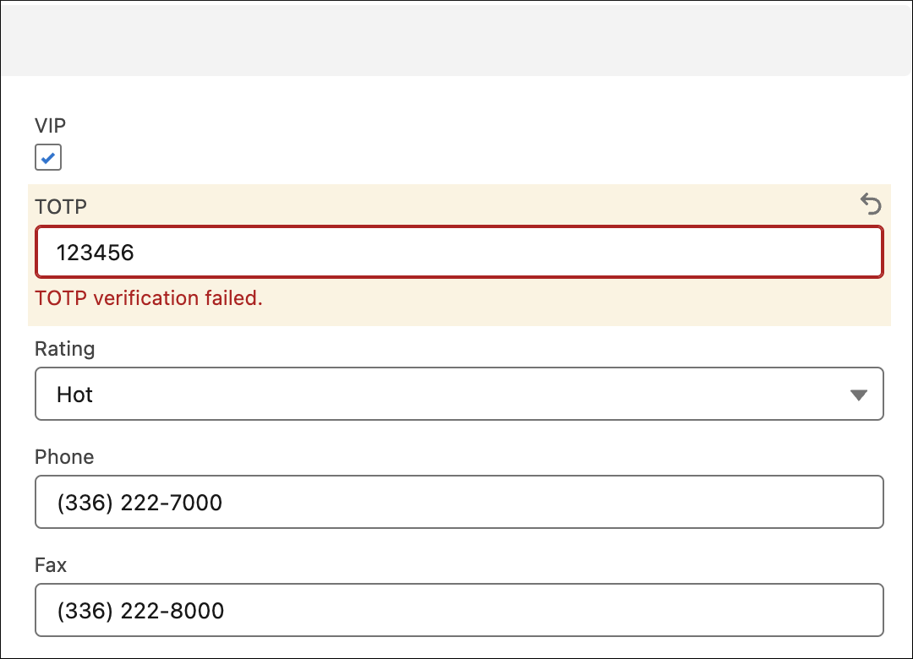
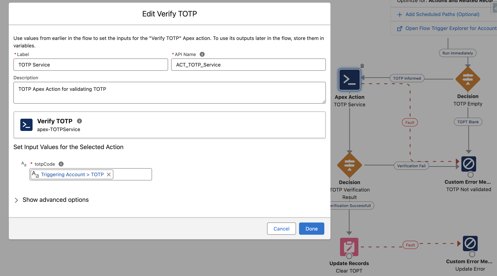

# TOTP-Salesforce: TOTP Service class


## Overview

This code is just for demo purposes. The `TOTPService` class is basicaly to show you how you can verify TOTP codes using invocable actions in Salesforce from Flows and other components, or directly from Apex. It’s like adding an extra security layer for your records and processes. In this demo, we’ve included a couple of fields and a triggered Flow to illustrate how it works. Imagine your account is a VIP – this setup prevents any changes to your data without a valid TOTP code. 



**Note:** It’s been a bit challenging to test with stubs, so we’re using dependency injection among other things to make testing easier and more effective.

## Installation

To deploy the `TOTPService`, you can either deploy the entire repository or just the necessary classes if you prefer to implement your own examples.

### Deployment Steps:

1. Clone the repository or download the zip file.
2. Deploy the `TOTPService` class.
3. Optionally, deploy the `TOTP_Triggered_flow_Action_Account` Flow and fields (`TOTP__c` and `VIP__c`) for testing.
4. Drag the account fields to the Account Lightning page.

## Usage

### Invocable Method

The `TOTPService` class provides an invocable method `verify TOTP` that can be used in Salesforce Flows. This method verifies the provided TOTP code and returns the verification result.

#### Example Usage in Flow:

1. Add an action in your Triggered-Flow and select `Verify TOTP`.
2. Provide the necessary inputs (TOTP code).
3. Use the output of the action to handle the verification result in your Flow logic.



### Using Apex

You can also use the `TOTPService` class directly from Apex code. Here's an example of how to call the service from an anonymous Apex block:

```apex
TOTPService.VerificationRequest request = new TOTPService.VerificationRequest();
request.totpCode = '123456'; // Set a valid TOTP code
TOTPService.VerificationResult result = (new TOTPService()).verify(request);

System.debug('Verification Result: ' + result.message);
System.debug('Is Success: ' + result.isSuccess);
```
## Contact
Any comments, feedback, suggestions for improvement, or reports of bugs are more than welcome. Feel free to reach me out at develop@mpdigitals.com.
